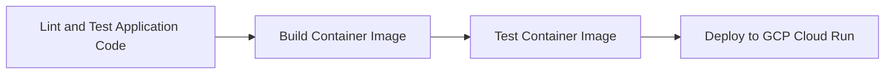

# The Mascot API

The Mascot API is a Python application that serves JSON data over HTTP using the Flask framework.

The project also includes a really awesome pipeline with the following stages:

:D
:D
